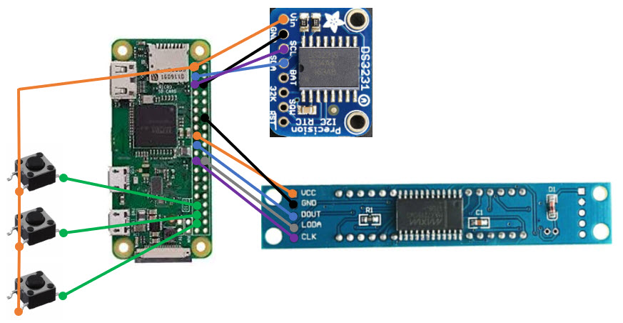

# Countdown
Generic coutdown -- days, hours, mins, secs

Let's time the making of this project.

  - `10m` Create repo and initial links
  - `20m` Schematic
  
# Links

[Adafruit RTC+Pi](https://learn.adafruit.com/adding-a-real-time-clock-to-raspberry-pi)

[DS3231+Pi](https://www.raspberrypi.org/forums/viewtopic.php?t=161133)

[SPI Display](https://www.amazon.com/gp/product/B07CL2YNJQ)

Max 7219

# Schematic

